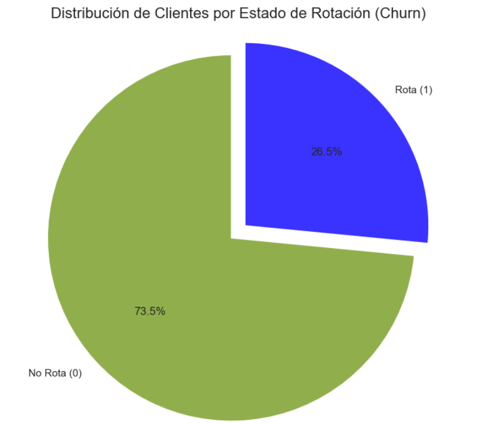
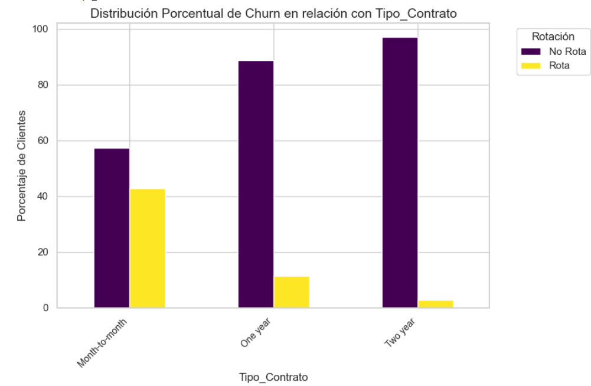
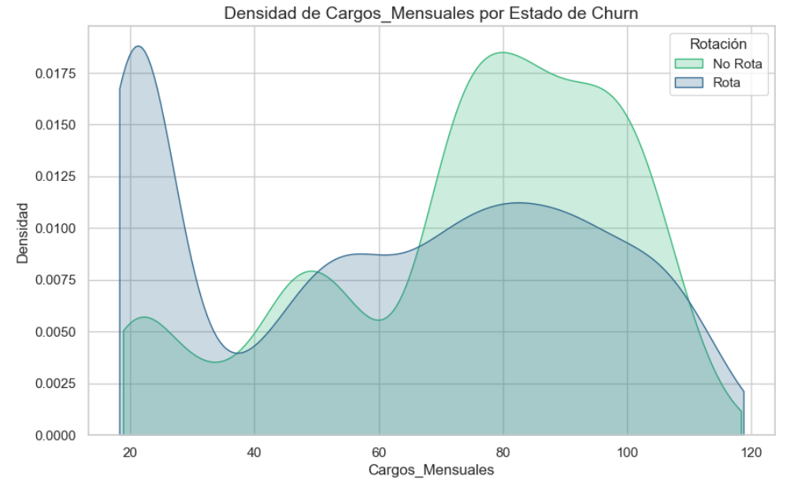

# Telecom-X Parte Dos - AluraLatam

## Descripción

Este proyecto corresponde a la segunda parte del curso de AluraLatam, enfocado en el análisis de datos de una empresa de telecomunicaciones. El objetivo principal es identificar patrones y tendencias en los datos de clientes para mejorar la toma de decisiones.


## Estructura del Proyecto

- `README.md`: Documentación del proyecto.
- `analisis.ipynb`: Notebook con el análisis exploratorio de datos y visualizaciones.
- `data/`: Carpeta con los conjuntos de datos utilizados.

## Instalación

1. Clona este repositorio:
    ```bash
    git clone https://github.com/tu-usuario/Telecom-X-Parte-Dos---AluraLatam.git
    ```
2. Instala las dependencias necesarias:
    ```bash
    pip install -r requirements.txt
    ```

## Uso

Abre el archivo `analisis.ipynb` en Jupyter Notebook o Google Colab para ejecutar el análisis y visualizar los gráficos.

## Conclusiones

A partir del análisis realizado, se obtuvieron las siguientes conclusiones:

- **Distribución de clientes:**  
    La mayoría de los clientes se concentran en ciertos segmentos demográficos y de servicios, lo que sugiere oportunidades para personalizar ofertas y mejorar la retención en grupos específicos.  
    

- **Churn por tipo de contrato:**  
    Se observó que los clientes con contratos mensuales presentan una tasa de abandono significativamente mayor en comparación con aquellos con contratos a largo plazo. Esto indica que incentivar contratos de mayor duración podría reducir el churn.  
    

- **Relación entre cargos mensuales y churn:**  
    Los clientes con cargos mensuales más altos tienden a abandonar el servicio con mayor frecuencia. Es recomendable revisar la estructura de precios y ofrecer beneficios adicionales a estos clientes para mejorar su satisfacción y permanencia.  
    

Estos gráficos muestran las tendencias clave identificadas en el análisis, facilitando la interpretación de los resultados y apoyando la toma de decisiones estratégicas orientadas a la retención y satisfacción del cliente.

## Autor

- [Rebeca Olivera More](https://github.com/rb-olivera)
